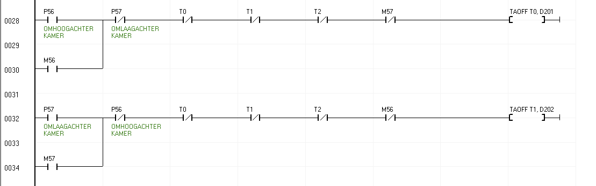
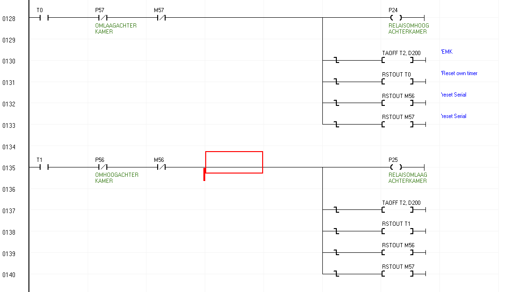
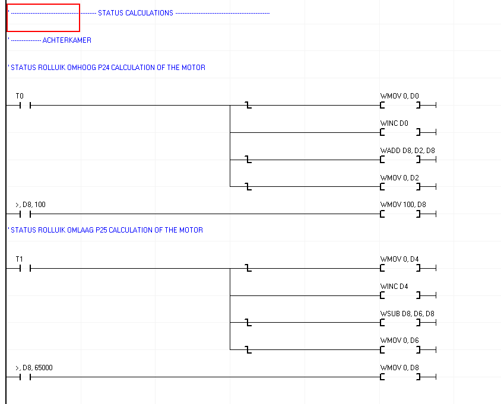
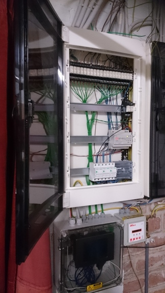
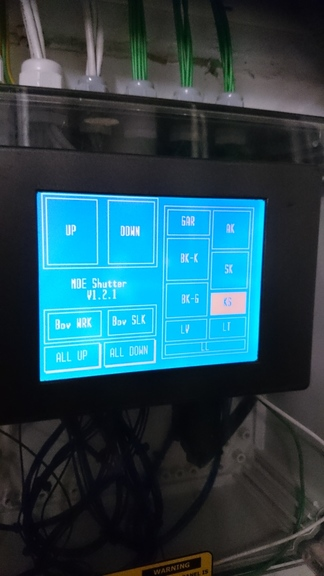
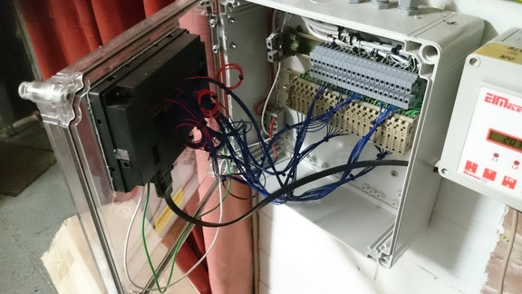
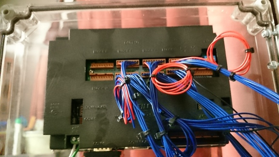
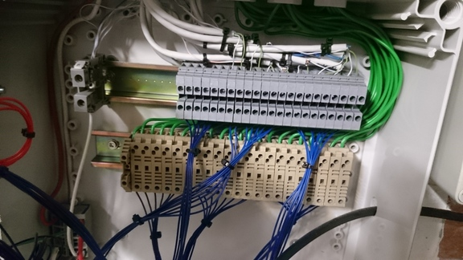
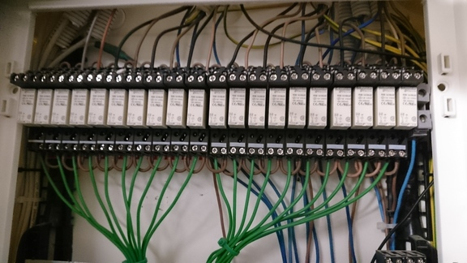
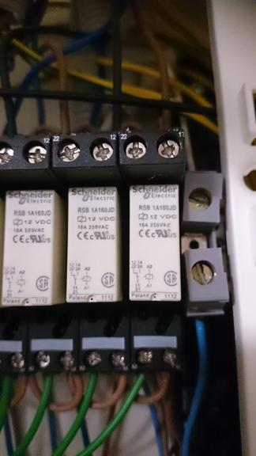

# Cubloc CT1720 PLC Shutter actuator

This code is created as a part of my own home automation system which is currently being replaced with a KNX shutter actuator.  
This system was running about more than one year as my primary source to control 11 shutters.

## Some highlights
* Each shutter up & down timings can be programmed.
* There is a "dead" zone between going UP & DOWN to avoid blowing out your relay with EMK. (500 ms). This for each shutter.
* Event driven with ladder interrupts & serial interrupts.
* Touch screen support to open or close each individual shutter or open / close ALL shutters.
* RS232 support to open or close each individual shutter or open / close ALL shutters.
* RS232 serial interrupt feedback that shows the status of a individual shutter (with offset of 1%) depending on timings.
* RS232 & physical push buttons can be used simultaneously.
* Touchscreen will be dimmed after 20 seconds. First touch will light up the backlight, second touch will control the elements on screen.

This code mimics a full blown Shutter Actuator like you would buy for a home automation system.

# Hardware

The hardware that is used for this shutter actuator is a `CT1720` from comfiletech. A `CT1721` also works.  
Comfiletech has a complete datasheet that contains the information for this PLC. This can be found starting at Chapter 12: Cutouch  

* [PLC hardware](http://comfiletech.com/embedded-controller/controller-with-touch/cutouch/ct1721c-mono-lcd-touch-cubloc-i-o/)
* [Datasheet & Basic code](http://comfiletech.com/content/cubloc/cublocmanual.pdf)

The PLC including the relays (Schneider 12V relays) where powered through a 7.5A - 12V DC power supply.  
For the output wiring, it is not required to use a buffer IC as the `CT1720` can deliver enough power to control a 12V relay. 
Even driving 11 at the same time.

## Hardware schematic for the shutter actuator

The full system was powered through a 12V - 7.5A  meanwell power supply. This includes the PLC, push buttons & all relays.

_{insert_hw_schematic here}

### Input

All inputs are described in the file: [shutterIO.inc](ShutterIO.inc)  
For each room two buttons were located to control the shutter for that particular room.  
The event inputs (56, 58, ...) where used for `UP`. The uneven inputs (57, 59, ...) where used for `DOWN`

Example:

```
Usepin 56,In,OmhoogAchterkamer ' Used for `UP` in bedroom 1 
Usepin 57,In,OmlaagAchterkamer ' Used for `DOWN` in bedroom 1
Usepin 58,In,OmhoogSlaapkamer  ' Used for `UP` in bedroom 2
Usepin 59,In,OmlaagSlaapkamer  ' Used for `DOWN` in bedroom 2
Usepin 60,In,OmhoogKeuken ' Used for `UP` in kitchen
Usepin 61,In,OmlaagKeuken ' Used for `DOWN` in kitchen
```

### Output

All outputs were wired like the same according to the inputs.
All outputs are described in the file: [shutterIO.inc](ShutterIO.inc)  
It is following the same format as the inputs.
The event inputs (24, 26, ...) where used for `UP`. The uneven inputs (25, 27, ...) where used for `DOWN`

Example:

```
Usepin 24,Out,RelaisOmhoogAchterkamer ' Used for `UP` in bedroom 1 (Relay)
Usepin 25,Out,RelaisOmlaagAchterkamer ' Used for `DOWN` in bedroom 1 (Relay)
Usepin 26,Out,RelaisOmhoogSlaapkamer ' Used for `UP` in bedroom 2 (Relay)
Usepin 27,Out,RelaisOmlaagSlaapkamer ' Used for `DOWN` in bedroom 2 (Relay)
Usepin 28,Out,RelaisOmhoogKeuken ' Used for `UP` in kitchen (Relay)
Usepin 29,Out,RelaisOmlaagKeuken ' Used for `DOWN` in kitchen (Relay)
```

# Software

The editor to upload & edit the basic & ladder code is Cubloc Studio which can be found here: [Support & software](http://comfiletech.com/pages/support.html).  
The code exists out of two different programming languages: `Basic` & `Ladder`.  
The most critical code is located in the Ladder diagram which is basically controlling the inputs, the output relays as well the EMK logic for each shutter.

The software works together meaning ladder interrupts which are from the ladder diagram to the basic code. (Through the `DoLadderInt` interrupt).
There is also basic to ladder interrupts through the datawords & merkers. (Most of the starting with `_D(XX)`)

## Ladder software

> The `ShutterIO.inc` allows you to name certain inputs which can be found in the ladder diagram.


### Ladder input logic.

The ladder input logic is sometimes hard to read. Especially the status calculation which uses WMOV, WINC & WADD on different data objects.   
The funny thing is, it is just to calculate a shutter percentage! This section will explain on what does what.

You have basically three sections in the ladder screen.

* Push button input logic
* Relay output logic
* Shutter status calculation (mixture of basic & ladder code)


#### Push button input logic.

For each room the same ladder code is used. This means for Ladder, duplication! 



Every row contains the logic for one specific button. The one starting with `P56` is the one for the UP. The one starting with `P57` is the one for down.  
Lets start with the first row. 

* P56 = Push button for Shutter `UP` & P57 = Push button for Shutter `Down`. This is explained in section: [Output](#output) & [Input](#input)  
** Due they are put serial, it is never possible to push `UP` & `DOWN` at the same time. Basically if the shutter goes up & you press down. The shutter will stop & the EMK deadzone will kick in which disables the buttons for 500 ms.


* T0 : This is the Timer 0 which represents the status of the `UP` part of the shutter.  
** T0 is required when the shutter is fully up (or down) it disconnects itself. Else the shutter actuator stays under power.    
* T1 : This is the Timer 1 which represents the status of the `DOWN` part of the shutter.  
** T1 is more of a guard check to disconnect the relay if the opposite relay is turned anyway. (To avoid damage to the shutter motor)    
* T2 : This is the Timer 2 which represents the EMK. If the relay is turned from "ON" to "OFF", this gets activated. Meaning it is not possible for the input to be sent to T0.  
** T2 activates when the relay goes "OFF"

* M56 is the simulated push button through RS232 & for the touchscreen. This acts as a physical button.

> This logic is also duplicated for the "DOWN" but reversed according the UP button. For each room, the timers ID's gets increased by `3`.   
> All the info can be found under: [shutter-timers.info](shutter-timers.info) on what they mean.

#### Output logic

For each room the same ladder code is used for the relays as well. So again duplication.



Once again, every row is used for one typical relay. This is for the same room as we mentioned on the Push button input logic part.  
Lets start with the first row.

* T0 : This is the timer that is set on the inputs, when this activates, `P24` will be attracted & the shutter relay for `UP` will activate.

* P57 : In case the push button is pressed to go down, `P24` will turn off. This is the same for the `M57` merker which is controlled through the touch screen / RS232.

* TAOFF T2, D200 : In the D200 variable (D stands for dataword), the EMK current status is reset on negative flank (OFF to ON).

* RSTOUT T0 : When the relay turns off, the timer status gets reset of T0 as well for M56 & M57.
 
* M56 & M57 : this resets the merker for the RS232 & the touchscreen interface. (On the basic code)

This output code is straight forward. If the input is actived, enable relay.   
When the relay gets turned off, it resets some parameters.

#### Status calculation logic.

Once again for each room, the same ladder code is used for status calculation. So for each room, this is duplicated although with their own merkers, data variables & timers.  
Although the ladder code is used for grabbing the current status. The percentage calculation is done in the ladder interrupt on the Calculation Sub which is located in the basic code.



Once again, every row is used for one typical status calculation. This is for the same room as we used for both previous explanations.
Lets start with the first row.

These are the variables used for `Bedroom 1`

```
D(0) = Counter increase shutter bedroom 1 up
D(2) = Status bedroom 1 up percentage (%)
D(3) = Status bedroom 1 up percantege (%) previous
D(4) = Counter increase shutter bedroom 1 down
D(6) = Status bedroom 1 down (%)
D(7) = Status bedroom 1 down (%) previous
D(8) = End result status shutter bedroom 1
```

So this ladder logic keeps the previous status, current status & the end result.

* T0 :  This is the timer which is used on the inputs. Basically when the input is on, it will start increasing the value in `D0`

* WMOV 0, D0 : This is a moving part that puts the value 0 into the data word D0 when the input goes from ON to OFF (negative flank)

* WINC D0 : This increases a counter for shutter `UP` calculation.

* WADDD D8, D2, D8 : This adds up dataword D2 & D8 together which is saved in the dataword `D8` (percentage) when the shutter goes OFF.

* WMOV 0, D2 : This resets the current percentage status.

* \>, D8, 100 : This is used to avoid overflowing the percentage (Max 100% is possible)

We also need the second row  to complete our calculation, this is the `DOWN` section.  
This is basically the same but for the DOWN status, although it is possible to have a `underflow`, meaning if the dataword (which can hold 0xFFFF value) underflows, it needs to be reset back to 0%.

> The rest of the status calculation can be found in the basic code.


#### Summary for ladder

The ladder code contains the most important code for the shutter actuator as ladder never fails.
> Note: The ladder diagram gets scanned 6000 times every second for changes.

In the application, we are also using basic interrupts. This allows the ladder code to execute basic code through INTERRUPTS which is done through the `DoLadderInt` interrupt located in the basic code.  
This is done by `F40` which can be found at the start of this ladder diagram. It gets activated when a dataword is different from 0.  
The interrupt will perform the rest of the calculation which is required to find the correct status of the shutters as mentioned in the status calculation section.  

---

There are a few files attached that contains information on which does what. Although some of it in still in dutch, it contains every single variable, constant, IO & timer that is used in this software.  

* [Shutter timers](shutter-timers.info)
* [Shutter constants](shutters-const.info)
* [Shutter variables](shutters-variables.info)
* [Shutter IO's](ShutterIO.inc)

# Basic software

The start of the application is mostly initialization. Although the #define are pretty important.  
The #defines allow you to set the shutter time definitions on how long it takes for a certain shutter to go UP or to get DOWN. (From fully DOWN to UP and from fully UP to down).   
This is required for the status calculation. (Unit: 1/10 second)

```
#define rolluikOmhoogAchterkamer 159 
#define rolluikOmlaagAchterkamer 156

#define rolluikOmhoogSlaapkamer 182
#define rolluikOmlaagSlaapkamer 172
```

After that it waits 200 ms before booting & initializing the serial communication in the Sub: `InitializeSerialCommunication`.  
This sets the Serial port to use BAUDRATE: `115200`, no parity, 1 stop bit with a receive buffer of 80 bytes & send buffer of 1kB.  
It also mentions if a serial interrupt is received, it should go to the Sub SERIALINTERRUPT.  

It enables the PLC outputs through `Set Outonly On`, enables the Ladder code through `Set Ladder On` & enables the touch screen.    
The touch screen is fully drawn in... Basic! This is done by importing the `ShutterScreen.inc` which contains a sub called Drawscreen. This fully draws the screen with interrupt attachments.  
The interrupt is initialized through the sub: `TouchScreen`.    

## Interrupts
The software is fully event handled driven. Meaning everything is done through interrupts either in basic or in ladder.

* SERIALINTERRUPT
* EVERY100ms
* TouchScreen

### SERIALINTERRUPT
The push buttons that are physically wired are interrupted in the ladder software, but the serial incoming data is handled here.  
Its a simple statemachine that is using the character `<` as a stop char. These example strings can be used to control certain shutters.  

Some examples:

* `<56<` : This open (up) the shutter in Bedroom 1.  
* `<57<` : This closes (down) the shutter in Bedroom 1.  
* `<1000<` : This triggers for every single shutter the "UP" merker. This is executed in the Sub: `AllUp`.  
* `<2000<` : This triggers for every single shutter the "DOWN" merker. This is executed in the Sub: `AllDown`.  

### EVERY100ms
This interrupt is created for the touch screen. After 20 seconds, the display turns off. 

### TouchScreen
When the touchscreen is pressed, it goes into this interrupt.  
It checks which button was pressed & depending on the location that was pressed, it will enable a certain merker and/or manipulate the menu's on the touch screen.

### Calculation

The calculation part is executed on the ladder interrupt (DoLadderInt). For every single percentage, it recalculates the status of the shutter.  
This also means if ALL shutters are going down or up, your serial port gets spammed with status reports of each individual shutter.
This is done with the Sub: `SendOutSerial`.

---

# Real life picture of the hardware

Overview of the installation:  



PLC detailed with touchscreen activated  


Wires  


The connection to the PLC  


Detailed of the wiring with the Wago's.  


Overview of the schneider relays  


Detailed schematic of a relay  


---

## License

This project is licensed under the Apache 2.0 License - see the [LICENSE](LICENSE.txt) for details. 


